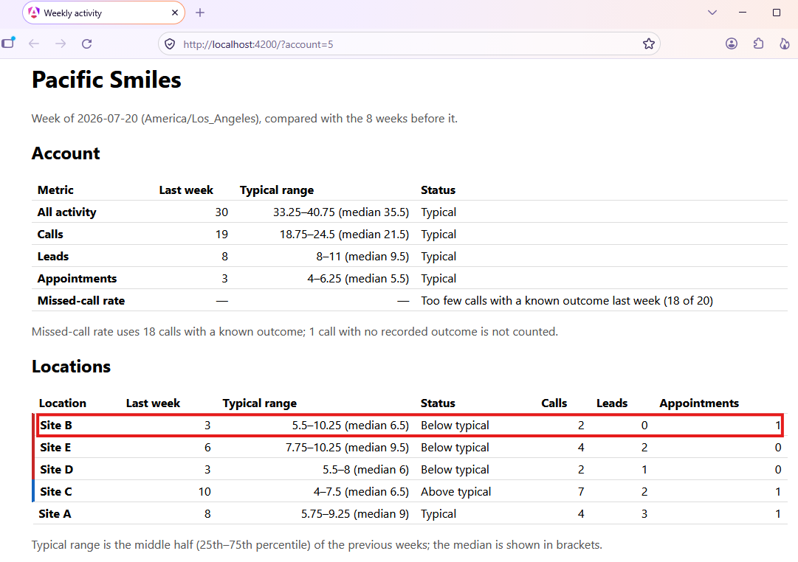

# Relay: "Is this normal for us?" (DASH-247)

A weekly dashboard view that tells a customer admin, for each location, whether last week's activity was normal *for that location*, and which site to call first.

For example, at Pacific Smiles (5 locations) in the week of 2026-07-20, the first row reads **Site B: 3 events against a typical range of 5.5–10.25 (median 6.5), Below typical**. That's the site to call on Monday morning.



- **Backend:** .NET 8 minimal API, EF Core migrations, explicit SQL for the aggregation. SQL Server 2022 in Docker.
- **Frontend:** Angular 22 SPA, one page.

## Quick start

```bash
docker compose up -d --build
```

- App, with the default week 2026-07-20 (the last complete week in the data):
  - http://localhost:4200/?account=5 (Pacific Smiles, 5 locations): the first row is **Site B, 3 events against a typical range of 5.5–10.25 (median 6.5), Below typical**. It is the one to call first.
  - http://localhost:4200/?account=12 (Redline Tire & Service, 7 locations): the first row is **Site C, 2 events against a typical range of 4–10.5 (median 8.5), Below typical**.
  - http://localhost:4200/?account=6 (Metro Collision Centers, 15 locations): a large account with no Below location that week. The first rows are Above typical (Site M, Site O, Site A).
- API: http://localhost:8080 (Swagger at `/swagger`, health at `/api/health`)
- First start applies migrations and loads `seed.sql` (Development only). Later starts skip the seed.
- Reset the database: `docker compose down -v`.

Host development (database in Docker, API and SPA on the host):

```bash
docker compose up -d sqlserver
dotnet ef database update --project backend/Relay.Api
dotnet run --project backend/Relay.Api      # http://localhost:5038
cd frontend && npx ng serve                 # http://localhost:4200, proxies /api to :5038
```

Prerequisites: .NET SDK 8.0.x (pinned by `backend/global.json`), `dotnet-ef` 8+ (`dotnet tool install --global dotnet-ef --version 8.0.31`), Docker with Compose, Node 24.

## How I read the ticket

My focus was to find out what the customer actually needs behind the ticket, and to let the schema and the seed data settle the decisions the ticket leaves open: what "normal" means, which week to report, at what grain, and how to treat messy rows. The goal was a thin, end-to-end feature that can be shown to product to get feedback, not a finished product. To make that feedback easy:
- every assumption is written down as a question for product ([PLAN.md §3](PLAN.md));
- every number behind a decision links to the query that produced it ([EVIDENCE.md](EVIDENCE.md));
- the thresholds are configurable, so the rules can change with feedback without code changes.

"Is this normal for us?" needs a reference point, a window and a grain. My answers:

| Question | Choice | Why |
|---|---|---|
| What is "normal"? | The location's **own** history: the median of the previous 8 complete weeks, with a P25–P75 range | The ticket says "for them", not "for peers". Median, not mean, because account 6 has one 881-event week against a median of 76 ([E-12](EVIDENCE.md#e-12)) |
| Which week? | The **last complete week** in the account's own timezone (Monday 00:00 to Monday 00:00) | A customer admin opens this on Monday morning. Partial weeks would always look "low" |
| What grain? | **Per location**, plus an account summary row | Support says multi-location customers can't spot which site needs attention |
| What does a location show? | Total, baseline median and range, a status: `Below`, `Above`, `Low volume`, `Typical` | One glance, no export |
| In what order? | Below (largest gap first), then Above, Low volume, Typical | Answers "which site do I call first?" without sorting |
| Account level | Status on the total, on each event type, and on the missed-call rate | Per-type status at *location* level is too noisy: 85% of those cells have fewer than 5 events ([E-11](EVIDENCE.md#e-11)) |

A status needs **both** a range breach and a minimum gap: Below means the value is under P25 *and* at least `max(3, 30% of the median)` under the median. This keeps a 2-vs-3 difference from lighting up a small site. All thresholds are in `appsettings.json` (`StatusRules`), validated at startup and echoed in the API response.

**User-controlled input:** the account is chosen on the page and lives in the URL (`?account=6`), so it survives a reload and can be shared. The API also accepts `?week=YYYY-MM-DD` (a local Monday) for earlier weeks, with validation and an `availableWeeks` range.

## Data handling

The seed is "real-world messy", so these are handled explicitly rather than ignored. Details and evidence are in [PLAN.md §2](PLAN.md).

| Issue in the seed | What I do |
|---|---|
| The data ends 2026-07-27, 66 days before today | "Now" is the latest `occurred_at`, injected as a .NET `TimeProvider` (config `Clock:NowUtc` overrides it). No `DateTime.Now` anywhere in reporting |
| 12 exact duplicate rows (12,626 raw, 12,614 deduplicated) | A SQL view `activity_events_dedup`; every count reads the view. The seed file is never modified |
| 3.1% of calls have a NULL outcome | Treated as *unknown*: shown as a count, excluded from the missed-call rate |
| Missed calls have durations, so duration doesn't follow outcome | `duration_seconds` is not used |
| Week edges differ by timezone (6 zones, one DST change on 2026-03-08) | C# converts each account's local Monday to UTC using IANA ids and passes `[start, end)` to SQL as parameters. SQL does no timezone math |
| Zero-event weeks and locations | Zero is a real value in the baseline; locations with 0 events are still listed |
| Account 20 has no events | HTTP 200, empty `locations`, UI shows "No activity recorded". Unknown account id is 404 |
| `Site A` exists in every account | A location is keyed by (account, location name) |
| Too few calls for a rate | No missed-call status, with a visible reason ("18 of 20 calls with a known outcome") rather than a blank |
| Fewer than 8 baseline weeks (early weeks via `?week=`) | Values shown, no status, reason `insufficient_history` |

## Known limitations

- **Thresholds flag a lot.** In week 2026-07-20 the default rules mark 23 of 69 locations (15 Above, 8 Below). Some Above flags are small absolute gaps at low volume (3 events). I left the rule as is and raised it as a product question ([PLAN.md](PLAN.md) §9 C1, C5); testing a volume-scaled gap is the first item in [What's next](#whats-next).
- **Missed-call rate is rarely available.** Only 5 of 19 accounts have enough calls with a known outcome in the reported week, so most accounts show a reason instead of a status (C2).
- **Appointments are mostly "Low volume" at account level** (14 of 19), because the counts are small (C3).
- **A location with a low typical volume that jumps shows `Above`**, not `Low volume` (D17). Product should decide whether to show both.
- **Deduplication assumes** rows identical except `id` are double submissions. A real repeat in the same second would be dropped.
- **Demo time is pinned to the data**, not live time (see Data handling).
- **No auth.** Any caller can read any account, as the brief allows.

## How the work was done

Agent-first, with the thinking done before the code.

1. **Prompts designed with an AI (meta-prompting).** I used Claude (chat) to design the prompts for each Claude Code session, using goal, constraints, edge cases and a checkable "done" for each one.
2. **Requirements turned into data questions.** In this Claude Code session, the agent read the ticket, product background, README and schema (but not the seed data) and listed every term that leaves a decision open, such as "normal", "this week" and "baseline". It turned each one into a data-profiling check, quoting the line it came from and the decision it would settle. I reviewed the list: I cut one check and pinned the definition of a week before anything ran.
3. **Profiling with evidence only.** The agent then ran the approved checks against the seed data, with every number backed by a query and its output. The results are in `EVIDENCE.md`. This is where vague terms got concrete definitions: "normal" became the median and P25–P75 range of the previous 8 complete weeks, and "significant" became a minimum margin of max(3 events, 30% of the median), with low-volume locations excluded.
4. **Plan before code.** `PLAN.md` was written from those findings and my decisions before any implementation, and committed first.
5. **Slice-by-slice implementation (S0–S6).** The full test suite ran after each slice, and new tests were shown failing before passing.

Raw sessions are in [ai-log/](ai-log/).

### Model strategy

Planning and implementation used different models on purpose.

- **Discovery and planning: Opus 5.5.** The risk in this ticket is ambiguity, not code. Vague requirements ("this week", "normal") had to become data checks. Contradictions had to be caught and trade-offs weighed. A wrong call at this stage spreads into everything built on it, so it gets the strongest model.
- **Implementation: Sonnet 5.5.** By the time coding starts, `PLAN.md` has fixed every decision, the response format, the golden values and a done-when check for each slice. Building against a spec that tight is mostly mechanical, so a faster, cheaper model fits.
- **Review: Opus 5.5 on the slices that produce numbers** (week boundaries, baseline logic, SQL aggregation). Getting the aggregates right matters more than feature count, so each of those slices gets a review before commit.

The handoff is safe because of the spec, not the model choice. Golden values make a wrong result fail a test instead of looking plausible. "Ask, don't choose" stops the implementer from silently filling a gap. And no test counts as passing until it has been seen failing first and then passing in the same session. Work goes back to the stronger model when a golden-value test fails and the fix isn't obvious, or when a new decision is needed.

## Tests

```bash
cd backend && dotnet test Relay.Api.Tests   # unit tests only: fast, no Docker
cd backend && dotnet test                   # unit + integration: needs Docker running
cd frontend && npx ng test --watch=false
```

Last run:
- backend unit: `Passed! - Failed: 0, Passed: 115, Skipped: 0, Total: 115`
- backend integration: `Passed! - Failed: 0, Passed: 24, Skipped: 0, Total: 24`, about 20 s including the container start
- frontend: `Test Files 2 passed (2), Tests 15 passed (15)`

What is covered:

- **Unit tests** (`Relay.Api.Tests`, Angular specs): the week calculator (IANA zones, DST), the baseline evaluator (percentiles, status rules, boundaries), thresholds validation, the response assembler, the clock registration, the EF model, and the Angular page states.
- **Integration tests** (`Relay.Api.IntegrationTests`): [Testcontainers](https://dotnet.testcontainers.org/) starts a throwaway SQL Server 2022 on a random port, so the compose database is untouched. `WebApplicationFactory` runs the real API against it. The app's own Development startup migrates and loads `seed.sql`, so seeding is tested too. The tests assert the golden values in [PLAN.md §6](PLAN.md):
  - the four §6 golden values over HTTP, e.g. account 1, week 2026-07-20: 34 calls, 12 leads, 7 appointments, total 53, missed-call rate 25.0%, typical;
  - the status counts across all 69 locations (40 typical, 15 above, 8 below, 6 low volume);
  - duplicates counted once, zero-event locations listed, D20 order;
  - the §5 edge cases (404, 400s, empty account, short history);
  - seeding happens once, and never in Production;
  - configuration effects (an invalid threshold stops startup; `Clock:NowUtc` moves the default week).
- **Not automated:** the Docker Compose stack itself (nginx proxy, container images) and the page in a real browser. Those were checked by hand.
- **Known risk: golden values are pinned to the seed.**
  - **Why they are hard-coded:** the expected values come from [EVIDENCE.md](EVIDENCE.md), computed outside the app (Python over SQLite). That is what makes them an independent check; deriving them from the app's own logic would only test the code against itself.
  - **Duplication:** they are repeated in PLAN.md, the unit tests and the integration tests. Each test cites its source (`// §6(b) / G-02`), but nothing ties the copies together.
  - **Tied to one seed:** they are valid only for the `seed.sql` whose sha256 is recorded in EVIDENCE.md, and nothing checks that hash today. If the seed changes, many tests fail at once with number mismatches, and nothing says the evidence is out of date.

## Notable technical choices

- **Deliberately simple structure.** One API project and one Angular feature folder, because this is a single read-only feature meant to get product feedback, and its scope may change after that feedback. The seams that matter are already there: the rules are pure classes with no database or clock (`Reporting/`), data access is in one place (`Data/`, one SQL query), and the endpoint only wires them together. When the product grows (more features, write paths, auth, per-account settings, more people on the code), I would split along those seams into separate projects, following Clean Architecture or vertical slices, whichever fits the features that actually arrive. Doing it now would add layers before the requirements that justify them.
- **Raw SQL (ADO.NET) for the aggregation, EF Core for schema and migrations.** One parameterised query returns every location × week × event type count, zero-filled, in one round trip. EF would need a hand-tuned query anyway, and the SQL is easy to compare with the golden values.
- **Baseline logic is a pure C# class** (`BaselineEvaluator`). No database or clock inside it, so every rule and boundary is a fast unit test.
- **Timezone math in C#, not SQL.** SQL Server cannot convert IANA zone names natively, and plain range filters keep the SQL simple.
- **Frozen clock as a keyed service.** The reporting clock is registered under the key `"reporting"`, so ASP.NET features that take a plain `TimeProvider` (auth, caching, logging) keep using real time.
- **State in the URL, no state library.** One page and one input: Angular signals and the router's query params are enough.
- **Docker for everything.** `docker compose up -d --build` gives the whole stack. nginx serves the SPA and proxies `/api`, so there is no CORS to configure.
- **Packages:** only what the `dotnet new` and `ng new` templates and EF Core need. Each addition was approved individually (recorded in [PLAN.md](PLAN.md) "Plan changes").

## What's next

Out of scope per the ticket or brief: auth, alerting, forecasting, CI, visual polish.

**Deferred by choice**

- **Per-account threshold overrides.** They need storage and an admin screen, which needs auth.
- **Peer or industry comparison.** The ticket says "typical for them".
- **Hour-of-day and call-duration views.** The UTC hour profile is identical in every timezone ([E-06](EVIDENCE.md#e-06)), so local hours are not credible; duration does not follow outcome ([E-17](EVIDENCE.md#e-17)).

**With one more day: product**

1. Query the effect of a volume-scaled gap (`k·√median`) on all 69 locations and pick the rule with product.
2. A week picker in the UI (or previous/next links), stored in the URL. The API already supports `?week=`, so this is UI-only.
3. A small trend line per location, from the 9 weekly counts the API already computes.
4. Answers from product on the open questions in [PLAN.md §3](PLAN.md) (Q1–Q10).

**With one more day: engineering quality** (any new package would go through approval, as everything else did)

- **Per-project agent guidance:** a `CLAUDE.md` in `backend/` and in `frontend/`, each with that project's commands, conventions and rules, instead of one shared file.
- **Pre-commit hooks** that run the quality gates for both projects (build, tests, lint and format checks), so nothing is committed with a failing gate.
- **Golden values in one place:** a `GoldenValues` class per test project, each value tagged with its `G-nn` id, so the copies can't drift. Also a seed-hash guard test that checks `seed.sql` against the sha256 in EVIDENCE.md first, so a changed seed fails once with "EVIDENCE.md is stale" instead of as a dozen number mismatches. See "Known risk" under Tests.
- **.NET:**
  - an `.editorconfig` plus static code analysis: the SDK's built-in analyzers turned up (`AnalysisLevel`, `EnforceCodeStyleInBuild`, warnings as errors), and possibly an analyzer package such as SonarAnalyzer. There is no `.editorconfig` or analyzer configuration in `backend/` today.
- **Angular:**
  - linting with ESLint (`angular-eslint`). It isn't set up today: there is no `lint` target and no ESLint packages.
  - an enforced Prettier check. Prettier is already installed with a `.prettierrc`, and all of `frontend/src` is formatted (`npx prettier --check "src/**/*.{ts,html,css}"` passes). But there is no script, hook or CI step that runs it, so it can drift again.
- **A code-review skill for the local AI agent,** so each slice is reviewed against the plan's decisions before it is committed.

## Repository layout

| Path | What it is |
|---|---|
| `PLAN.md` | The plan, written before coding; decisions D1–D30 |
| `EVIDENCE.md` | Every number in the plan, with its query and output |
| `ai-log/` | Raw AI sessions |
| `backend/Relay.Api` | API: `Reporting/` (week calculator, evaluator, assembler, endpoint), `Data/` (EF model, migrations, weekly-counts SQL, dev seeder), `Time/` (reporting clock) |
| `backend/Relay.Api.Tests` | xUnit unit tests (no Docker) |
| `backend/Relay.Api.IntegrationTests` | xUnit integration tests: Testcontainers SQL Server + `WebApplicationFactory` |
| `frontend/src/app/weekly-status` | The page, service, model and labels |
| `schema.sql`, `seed.sql` | Provided source data, unchanged |
| `docker-compose.yml` | SQL Server, API and frontend |
